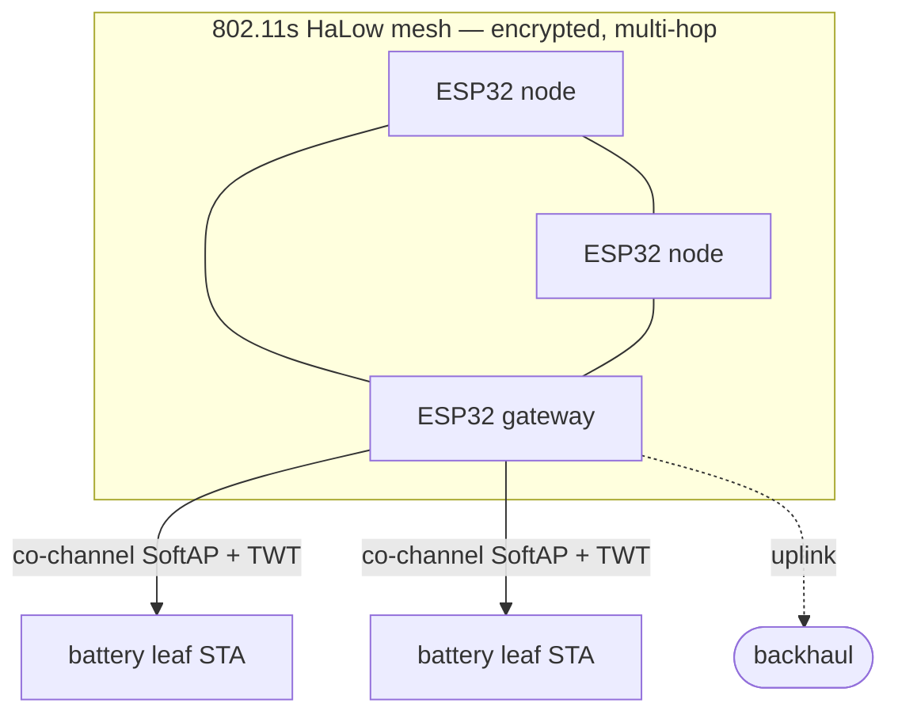

# mm-esp32-halow

**Wi-Fi HaLow (802.11ah) networking for the ESP32** — turn an ESP32-S3 + Morse Micro
**MM6108** into a node in a long-range, low-power, **encrypted 802.11s mesh**. This is the
radio/MAC layer of the [Rimba](https://github.com/teapotlaboratories/rimba) protocol: a
fork of Morse Micro's ESP-IDF HaLow component with a full mesh + security + power-save
stack ported on top.

Wi-Fi HaLow is sub-GHz (~900 MHz) Wi-Fi built for IoT — roughly a kilometre of range at
low power and low data rates, where 2.4/5 GHz Wi-Fi can't reach. Upstream `esp-halow`
gives you HaLow **STA + SoftAP**; this fork adds what a self-healing sensor network needs:
**802.11s meshing, mesh security, a mesh↔Wi-Fi gateway, and TWT battery-leaf sleep.**

> **Experimental & AI-assisted.** Part of the experimental Rimba research protocol —
> **not production-ready**. Much of the porting and documentation here is produced with
> AI-assisted (agentic) coding, directed and reviewed by the maintainer. Expect rough
> edges, unverified assumptions, and breaking changes.

## What it enables

With this component an ESP32-S3 + MM6108 can:

- **Join an encrypted HaLow mesh** — 802.11s peering secured with SAE + AMPE + CCMP,
  **relaying multi-hop** via HWMP path selection. Self-healing, no infrastructure.
- **Be a mesh ↔ Wi-Fi gateway** — run the mesh *and* a co-channel SoftAP on one radio,
  routing between battery leaves and the mesh backbone.
- **Sleep as a battery leaf** — associate to a gateway AP and TWT / WNM-sleep while the AP
  buffers downlink until wake.
- **Scale as a HaLow AP** — up to 255 associated STAs (four-block S1G TIM, PSRAM-backed).
- **Run ad-hoc (IBSS)** — infrastructure-free peer discovery, as an alternative L2.

## What this is

A fork of Morse Micro's [`esp-halow`](https://github.com/MorseMicro/esp-halow) ESP-IDF
component (upstream `2.10.4-esp32-2`, Apache-2.0) — the MM6108 driver + firmware glue
(`mmhalow.*`), the `mm-iot-sdk` / `morselib` MAC stack, `hostap` supplicant/crypto, and
the regulatory DB — with Rimba's 802.11-feature ports layered into `morselib`.

## Features & test results

Every 802.11 feature below is ported from the Linux reference (`net/mac80211`,
`morse_driver`, `wpa_supplicant`/`hostapd`) and verified on hardware — an ESP32-S3 +
MM6108 bench with a Raspberry Pi HaLow sniffer/peer. The **PR** column links each pull
request; deeper detail lives in the superproject's `docs/mesh-ap/` + `docs/ibss/`
milestones and `docs/worklog/`.

### 802.11s mesh

| Feature | Verified | PR |
|---|---|---|
| Mesh control + data plane (P1–P6b): MPM peering, HWMP (PREQ/PREP/PERR + path table), 4/3-addr unicast + group forwarding | ESP32 joins a Linux HaLow mesh; pings, originates + relays **multi-hop**, group-forwards, PERR teardown | [#10](https://github.com/teapotlaboratories/mm-esp32-halow/pull/10) |
| Airtime link metric (P6c) — byte-exact `airtime_link_metric_get` port | hw-verified (metric 5462/30038 on a 3-board line); replaces the fixed per-hop cost | [#15](https://github.com/teapotlaboratories/mm-esp32-halow/pull/15) |
| Real per-peer rate control feeding the metric | on-air: PREQ carries the RC-learned (non-tier) metric | [#19](https://github.com/teapotlaboratories/mm-esp32-halow/pull/19) |
| HWMP multi-path dedup + per-reply SN fix | fixes flooded-PREQ path flapping (climbing-SN PREPs) | [#15](https://github.com/teapotlaboratories/mm-esp32-halow/pull/15) |
| Preemptive HWMP path refresh | A/B: baseline stalls at the 30/60 s path expiry (seq 32/62), hardened build doesn't | [#14](https://github.com/teapotlaboratories/mm-esp32-halow/pull/14) |
| Path table: dest-MAC FNV-1a hash index (8 → 256 paths) + 16 peers | host + bench verified, 0%-loss datapath through the hashed table | [#16](https://github.com/teapotlaboratories/mm-esp32-halow/pull/16) [#18](https://github.com/teapotlaboratories/mm-esp32-halow/pull/18) |
| Runtime single-hop / leaf toggle | disables forwarding + HWMP at the sole TX chokepoint | [#12](https://github.com/teapotlaboratories/mm-esp32-halow/pull/12) |

### Mesh security

| Feature | Verified | PR |
|---|---|---|
| Secured mesh — SAE + AMPE + host **SW-CCMP** + MFP (Linux line-by-line) | single- **and** multi-hop relay, on-air verified | [#11](https://github.com/teapotlaboratories/mm-esp32-halow/pull/11) |
| SAE hardening — GAP-C forged-Commit reject + open/secured toggle + open-relay parity | empirically validated via a SAE-injector A/B (hardened vs baseline) | [#13](https://github.com/teapotlaboratories/mm-esp32-halow/pull/13) |
| SW-CCMP bulk-DMA AES-CCM | relay crypto **~14–28× cheaper** (enc avg 7038 → 197 µs); RFC-3610 KAT + `mbedtls_ccm` cross-check + on-device ping | [#22](https://github.com/teapotlaboratories/mm-esp32-halow/pull/22) |

### IBSS / ad-hoc

| Feature | Verified | PR |
|---|---|---|
| MM6108 IBSS / ad-hoc + per-peer records (RX dedup/seq, `0x88B5`) | derived + verified against Linux `morse_driver` + `mac80211` | [#1](https://github.com/teapotlaboratories/mm-esp32-halow/pull/1) |
| Linux-faithful bring-up + S1G-beacon `source_addr` peer discovery | ESP↔ESP 2- and 3-node full mesh, 3/3 bidirectional | [#2](https://github.com/teapotlaboratories/mm-esp32-halow/pull/2) [#4](https://github.com/teapotlaboratories/mm-esp32-halow/pull/4) |
| S1G beacons pre-association (mixed-cell phantom-flood fix) | chronium → each ESP 4/4; station dump = 3 real peers (was flooded) | [#3](https://github.com/teapotlaboratories/mm-esp32-halow/pull/3) |

### TWT + power-save

| Feature | Verified | PR |
|---|---|---|
| AP-side TWT responder (host-side SP serving) + assoc-time PS fix | a STA **TWT-sleeps** under the ESP32 AP (downlink buffered + flushed on wake) | [#5](https://github.com/teapotlaboratories/mm-esp32-halow/pull/5) [#6](https://github.com/teapotlaboratories/mm-esp32-halow/pull/6) |
| STA-side action-frame TWT **requester** (mid-session, assoc-preserving) | Setup/Teardown action frames, agreement installed/freed | [#9](https://github.com/teapotlaboratories/mm-esp32-halow/pull/9) |
| SoftAP **WNM-sleep** responder + S1G beacon-interval fix | a PMF STA enters **and** exits extended sleep against the ESP AP (dozes ~4 mA) | [#20](https://github.com/teapotlaboratories/mm-esp32-halow/pull/20) |

### AP scaling

| Feature | Verified | PR |
|---|---|---|
| STA-count ceiling → 255 (four-block S1G TIM) + configurable cap + PSRAM STA/TWT tables | build-verified at cap=255 + PSRAM; on-air regression (ESP AP + 2 ESP + Linux STA, 3 concurrent SAE) | [#7](https://github.com/teapotlaboratories/mm-esp32-halow/pull/7) [#8](https://github.com/teapotlaboratories/mm-esp32-halow/pull/8) |

### Mesh + AP concurrency (the gateway)

| Feature | Verified | PR |
|---|---|---|
| Co-channel 802.11s mesh + SoftAP + routed gateway datapath on **one** MM6108 | concurrent mesh+AP beaconing captured on air; a STA under the AP routes to a 2nd mesh node and back (ping **10/10 ttl=63**) | [#21](https://github.com/teapotlaboratories/mm-esp32-halow/pull/21) |

## Layout

| Path | What |
|---|---|
| `mmhalow.c` / `.h` | ESP-IDF ↔ `mmwlan` glue + the `esp_netif` driver (public API `mmhalow_*`). |
| `components/mm-iot-sdk`, `components/morselib` | the MM6108 MAC stack — where the Rimba ports live (`morselib/src/umac/…`). |
| `components/hostap` | supplicant + crypto (SAE, AES-CCM). |
| `components/shims`, `mmpktmem`, `mmutils`, `regdb` | platform shims, packet memory, regulatory DB. |
| `examples/` | upstream Morse Micro examples (`scan`, `softap`, `sta_connect`, `iperf`, `dual_if`, …). |

## Using it

Not a standalone project — it's the `components/halow` submodule of
[Rimba](https://github.com/teapotlaboratories/rimba), which supplies the ESP-IDF build
(`idf >=5.4.2,<6.0`), the pinned MM6108 firmware (`vendor/morse-firmware`), and the app
firmware that links it. To try it, clone the superproject **with submodules** and build
one of its `firmware/` apps onto an ESP32-S3 + MM6108 board. Driver/API usage otherwise
follows Morse Micro's upstream [`esp-halow`](https://github.com/MorseMicro/esp-halow).

## License

Apache-2.0 (upstream Morse Micro). The Rimba ports follow the upstream license.
